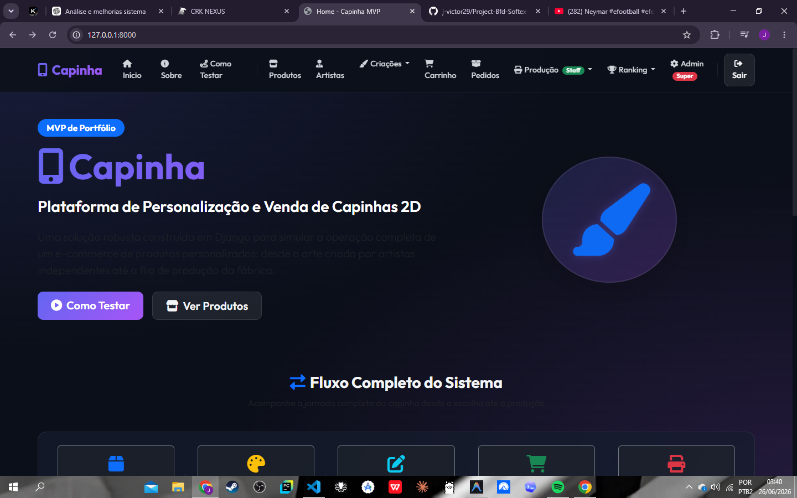
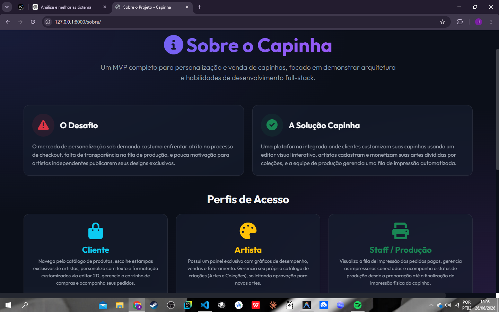
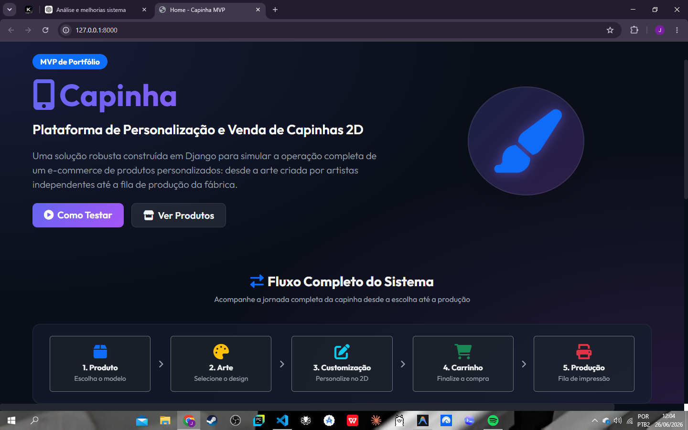
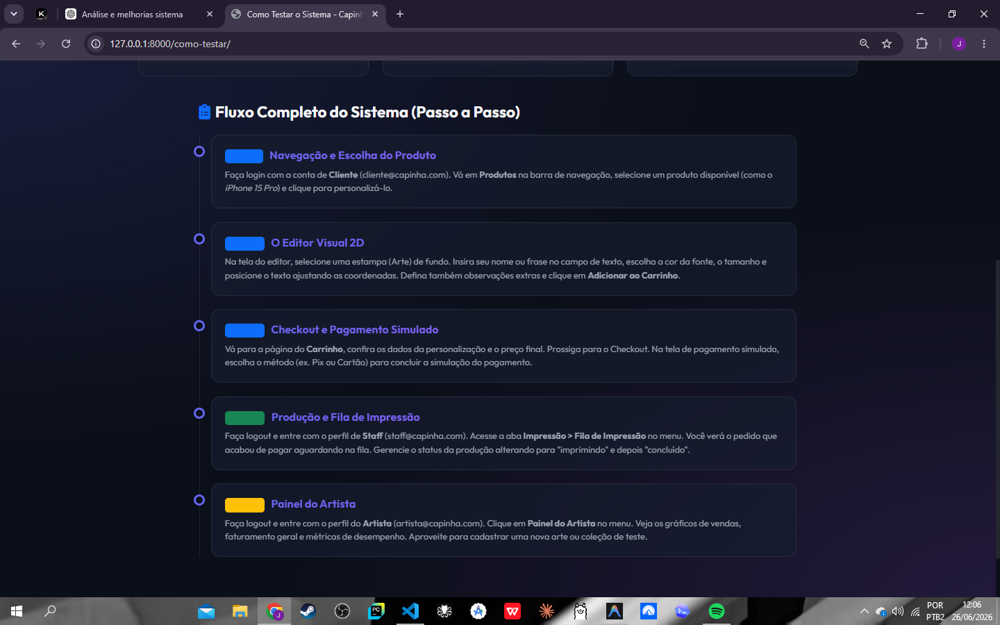
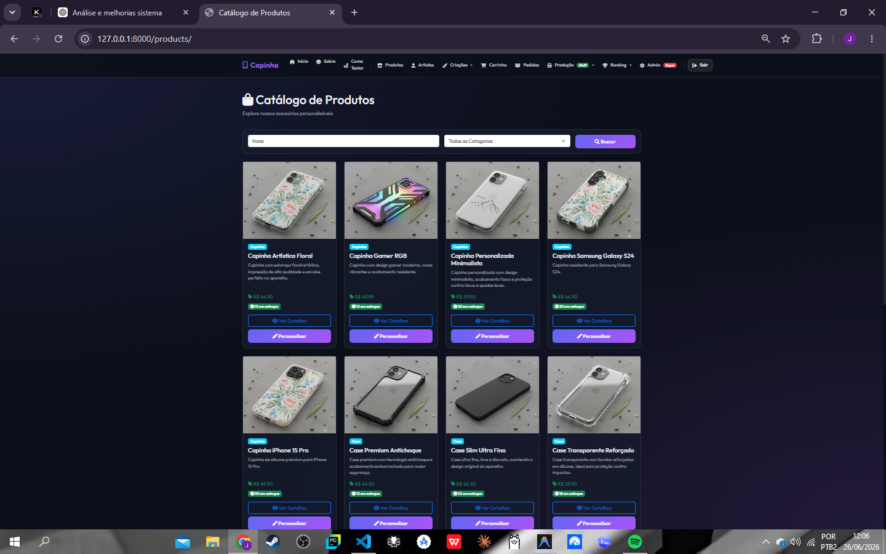
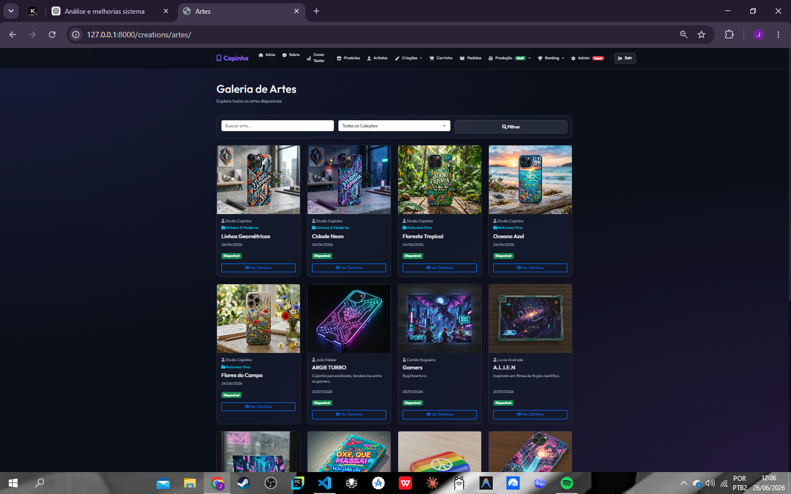
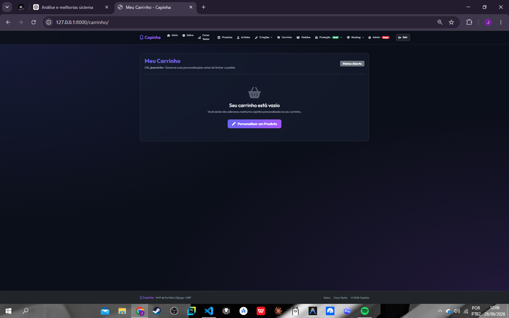
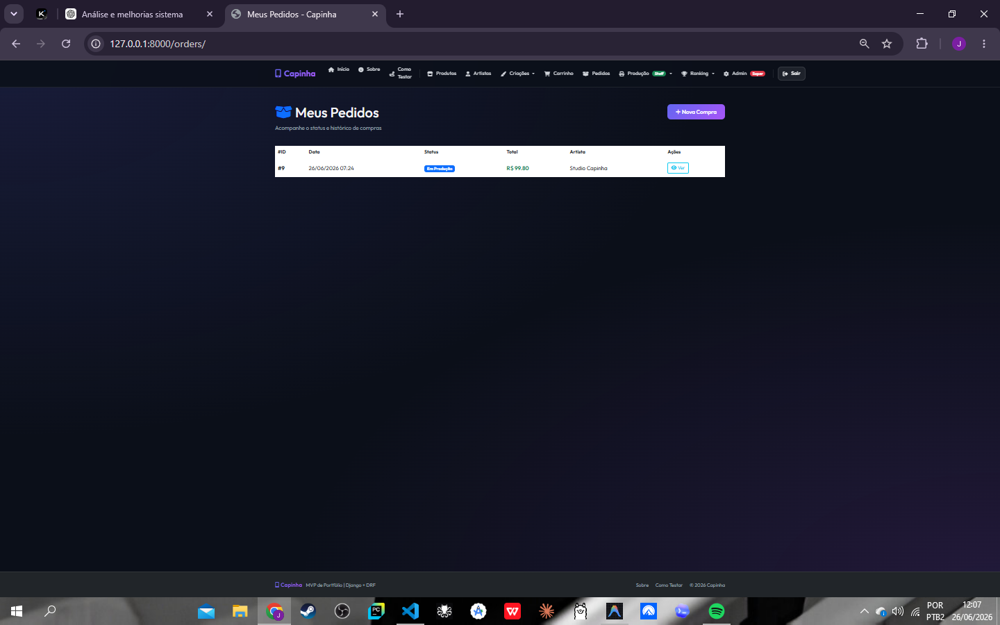
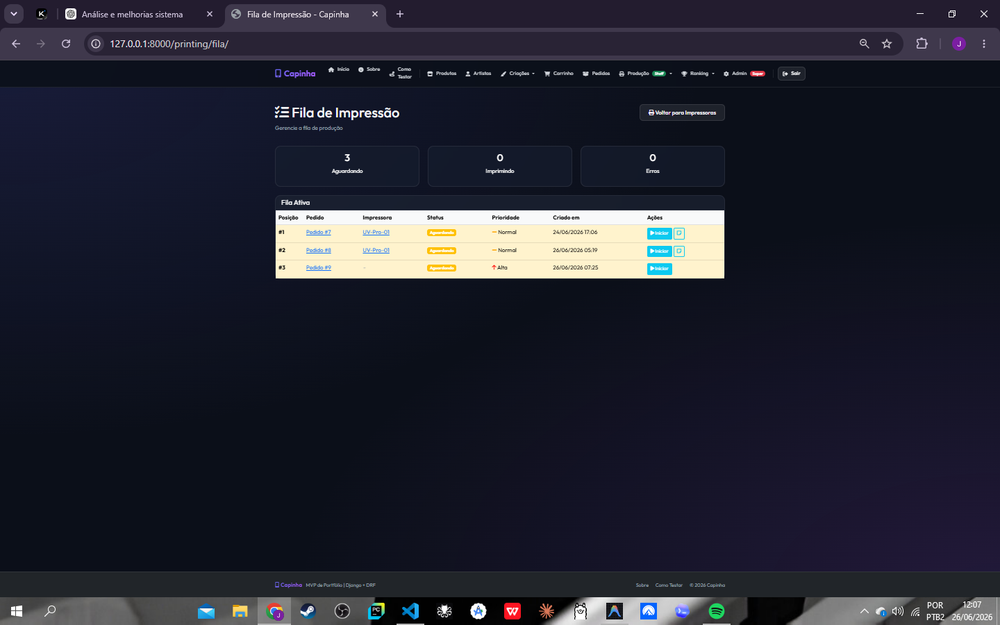

# 🎨 Capinha — Plataforma de Personalização de Capinhas


> **Projeto de portfólio** demonstrando um sistema web completo com Django. O objetivo é mostrar domínio de arquitetura modular, fluxo de e-commerce completo, testes automatizados, segurança por permissões e organização de código profissional.

---

## 📋 Sumário

- [Sobre o Projeto](#sobre-o-projeto)
- [Funcionalidades](#funcionalidades)
- [Tecnologias](#tecnologias)
- [Arquitetura por Apps](#arquitetura-por-apps)
- [Fluxo do Sistema](#fluxo-do-sistema)
- [Perfis de Usuário](#perfis-de-usuário)
- [Capturas de Tela](#-capturas-de-tela)
- [Como Instalar](#como-instalar)
- [Como Rodar](#como-rodar)
- [Usuários de Demonstração](#usuários-de-demonstração)
- [Checklist de Teste Manual](#checklist-de-teste-manual)
- [Diferenciais Técnicos](#diferenciais-técnicos)
- [Roadmap Futuro](#roadmap-futuro)
- [Roteiro de Apresentação](#roteiro-de-apresentação)

---

## 📖 Sobre o Projeto

**Capinha** é um MVP de plataforma de personalização e venda de capinhas para celular, desenvolvido como **projeto institucional real** durante o curso de capacitação em **Back-End com Python**, realizado pelo programa **Bolsa Futuro Digital (BFD)**, em parceria com a **Softex/Aponti**, em Pernambuco.

O projeto foi construído a partir de uma demanda real apresentada pela empresa **Greencase**, que trouxe uma necessidade relacionada à personalização, organização e comercialização de produtos personalizados. A partir desse contexto, a proposta do sistema foi transformar uma necessidade empresarial em uma solução web funcional, estruturada e demonstrável.

Diferente de um projeto puramente fictício, o **Capinha** foi desenvolvido com base em um cenário real de negócio, considerando dados, fluxos e necessidades reais da empresa parceira. O objetivo foi aplicar, na prática, os conhecimentos adquiridos no curso como modelagem de dados, arquitetura modular, autenticação, permissões, regras de negócio, testes automatizados e organização profissional de código.

O sistema simula o ciclo completo de um e-commerce de produtos personalizados:

1. Artistas independentes cadastram suas artes e coleções no sistema
2. Clientes navegam pelo catálogo, escolhem produtos e personalizam via editor 2D
3. O pedido é adicionado ao carrinho e segue para checkout
4. O pagamento é confirmado de forma simulada
5. A equipe de produção gerencia a fila de impressão dos pedidos pagos

> ⚠️ O pagamento neste MVP é **simulado** e os dados públicos do repositório devem ser tratados como dados de demonstração. O foco do projeto é demonstrar a arquitetura, os fluxos de negócio e a aplicação prática de uma solução desenvolvida a partir de uma necessidade empresarial real.

---

## ✅ Funcionalidades

| Módulo | Descrição |
|--------|-----------|
| 🛍️ Catálogo de Produtos | Listagem, busca e filtro por categoria |
| 🎨 Artes e Estampas | Biblioteca de designs criados por artistas parceiros |
| ✏️ Editor 2D e 3D | Personalização visual com texto, cor, fonte e posicionamento |
| 🛒 Carrinho de Compras | Carrinho persistente com personalização detalhada |
| 📦 Pedidos | Ciclo de vida completo: criado → pago → em produção → impresso |
| 💳 Pagamento Simulado | Confirmação de pagamento por método (Pix/Cartão) sem API real |
| 🖨️ Fila de Impressão | Painel de produção com controle de status e impressoras |
| 🎭 Painel do Artista | Dashboard exclusivo com métricas de vendas e CRUD de artes/coleções |
| 🏆 Gamificação | Sistema de pontos, badges e ranking para artistas |
| 👥 Autenticação | Controle de acesso por perfil de usuário |

---

## 🛠️ Tecnologias Utilizadas

- **Backend:** Django 5.x, Django REST Framework, Python 3.11+
- **Banco de Dados:** SQLite
- **Frontend:** Bootstrap 5, HTML/CSS customizado, JavaScript vanilla
- **Autenticação:** `django.contrib.auth` com modelo de usuário customizado
- **Gerenciamento de dependências:** pip / requirements.txt
- **Configuração:** python-decouple para variáveis de ambiente

---

## 📁 Arquitetura por Apps

O projeto segue o princípio de responsabilidade única, com cada app tendo escopo bem definido:

```
capinha/
├── core/           # Configurações, URLs raiz, views institucionais, seed_demo
├── users/          # Modelo de usuário customizado (AUTH_USER_MODEL)
├── products/       # Catálogo de produtos (Produto)
├── artists/        # Perfil de artista, painel e métricas (Artista)
├── creations/      # Artes, Coleções e Personalizações (Arte, Colecao, Personalizacao)
├── cart/           # Carrinho de compras (Carrinho, ItemCarrinho)
├── orders/         # Pedidos e itens (Pedido, ItemPedido, PedidoService)
├── payments/       # Pagamento simulado (Payment)
├── printing/       # Fila de impressão e impressoras (FilaImpressao, Impressora)
└── gamification/   # Pontos, badges e ranking (Ponto, Badge, Ranking)
```

---

## 🔄 Fluxo do Sistema

```
[Cliente] → Escolhe Produto
         → Seleciona Arte (do artista)
         → Editor 2D (texto, cor, fonte, posição)
         → Adiciona ao Carrinho
         → Checkout → Pagamento Simulado
         
[Staff]  → Vê pedido pago na Fila de Impressão
         → Gerencia impressora e status
         → Atualiza: aguardando → imprimindo → concluído
         
[Artista]→ Painel do Artista
         → Métricas de vendas / faturamento
         → Posta suas artes no sistema
         → CRUD de Artes e Coleções
```

---

## 👥 Perfis de Usuário

| Perfil | Acesso |
|--------|--------|
| **Cliente** | Produtos, Editagem do seu Produto (Personalização), Carrinho, Pedidos, Pagamento Simulado |
| **Artista** | Tudo do Cliente + Painel do Artista (CRUD de artes/coleções, métricas) |
| **Staff** | Tudo do Cliente + Produção (Fila de Impressão, Impressoras, Todos os Pedidos) |
| **Admin** | Acesso total ao Django Admin |

---

## 📸 Capturas de Tela

Abaixo estão as principais telas do sistema em funcionamento:

1. **Página Inicial (Landing Page)**: Apresentação moderna do sistema e atalhos rápidos.
   
2. **Sobre o Projeto**: Detalhes do escopo e arquitetura.
   
3. **Fluxo Completo do Sistema (Passo a Passo)**: Instruções passo a passo com credenciais de demonstração.
   
4. **Catálogo de Produtos**: Seleção de modelos de capinha de celular.
   
5. **Galeria de Artistas**: Navegação das criações dos artistas.
   
6. **Coleções de Artes**: Edição em tempo real das coleções dos artistas.
   
7. **Galeria de Artes**: Navegação por estampas e criações dos artistas.
   
8. **Carrinho de Compras**: Detalhamento dos produtos personalizados prontos para checkout.
   
9. **Detalhe do Pedido**: Acompanhamento do status do pedido realizado.
   
10. **Fila de Impressão**: Gestão do status de produção dos pedidos pela equipe de Staff.
    
11. **Fila de Impressão**: Fila de Impressão: Gestão do status de produção dos pedidos
    
12. **Pagamento Simulado**: Confirmação simulada de Pix ou Cartão de Crédito.
    
13. **Gerenciamento de Premiações e Recompensas para Clientes**: Organização de Premiações e Recompensas para Clientes com dashboard completo integrado.
    

---

## ⚙️ Como Instalar

### Pré-requisitos

Antes de começar, instale as ferramentas necessárias:

| Ferramenta | Versão mínima | Download |
|------------|:-------------:|----------|
| **Python** | 3.11+ | [python.org/downloads](https://www.python.org/downloads/) |
| **Git** | qualquer | [git-scm.com/downloads](https://git-scm.com/downloads) |
| **pip** | incluso no Python | (já vem junto com o Python 3.11+) |

> 💡 Verifique as instalações com `python --version` e `git --version` no terminal.

### Instalação

```bash
# 1. Clone o repositório
git clone https://github.com/j-victor29/Project-Bfd-Softex-Aponti.git
cd Project-Bfd-Softex-Aponti

# 2. Crie e ative o ambiente virtual
python -m venv venv

# Windows
venv\Scripts\activate
# Linux/Mac
source venv/bin/activate

# 3. Instale as dependências do projeto
pip install -r requirements.txt
```

> **Dependências instaladas automaticamente** pelo `requirements.txt`:
> - `Django` — framework web
> - `djangorestframework` — API REST
> - `python-decouple` — variáveis de ambiente
> - `Pillow` — processamento de imagens

---

## 🗄️ Como Rodar Migrations

```bash
python manage.py makemigrations
python manage.py migrate
```

---

## 🚀 Como Iniciar o Servidor

```bash
python manage.py runserver
```

Acesse: [http://127.0.0.1:8000/](http://127.0.0.1:8000/)

---

## ⭐ Diferenciais Técnicos

| Diferencial | Descrição |
|-------------|-----------|
| 🏗️ **Arquitetura modular** | 9 apps Django com responsabilidade bem definida |
| 🧪 **Testes automatizados** | Cobertura de fluxos de carrinho, permissões de artista, páginas institucionais |
| 🔐 **Permissões por perfil** | Links e views protegidos por decorators e condicionais de template |
| 🛡️ **Transações atômicas** | Uso de `transaction.atomic` em operações críticas do carrinho e pedidos |
| 🌱 **Seed idempotente** | `seed_demo` pode ser executado múltiplas vezes sem criar duplicatas |
| 📊 **Painel do Artista** | Dashboard com métricas de faturamento e CRUD completo de artes |
| 🎨 **Editor 2D** | Personalização visual em tempo real com persistência no banco |
| 📋 **Fila de Produção** | Ciclo completo de pedido até impressão física com gestão de status |
| 🛒 **Carrinho persistente** | Carrinho salvo no banco com personalização detalhada vinculada |
| 🏆 **Gamificação** | Sistema de pontos, badges e ranking para engajamento de artistas |
| 📝 **Validações robustas** | Formulários validados no backend + proteção CSRF |
| 🎨 **UI Moderna** | Interface dark/glassmorphism com Bootstrap 5, responsiva e animada |

---

## 🗺️ Roadmap Futuro

As seguintes melhorias estão planejadas para versões futuras, mas **não foram implementadas neste MVP** para manter a simplicidade:

- [ ] Integração com **Mercado Pago / Stripe** para pagamento real
- [ ] Integração com API de **frete** (Correios / Melhor Envio)
- [ ] **Notificações por WhatsApp** (via Twilio ou Evolution API)
- [ ] **Editor 3D** com Three.js para preview mais realista
- [ ] **Deploy em produção** (Railway, Heroku ou VPS)
- [ ] Autenticação com **OAuth** (Google, GitHub)
- [ ] **API REST pública** com autenticação por Token para integrações

---

*Desenvolvido por João Victor — 2025/2026*
